# Start a new analysis

## Choose your network data capture files

AGILITY analyzes the information from network data capture files (PCAPs
(packet captures)) into actionable insights.

To start a new analysis, you can upload your PCAP file, select a
previously uploaded file, or run a mock analysis using a sample network
data capture file.

**Note:** The maximum allowable PCAP upload size on the AGILITY UI is 95
MB PCAP per analysis session.

1.  Select **Start a New Analysis** from the side navigation panel.
  
    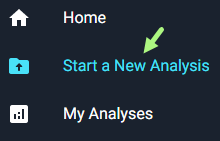

    The **Start a New Analysis** page opens.

2.  Choose your analysis path:

<Tabs>
  <TabItem value="Upload New File" label="Upload New File" default>

AGILITY supports:

* pcap
* .pcapng
* .cap
* .zip

You can only upload one file at a time.

1. To upload a new network data capture file for analysis, click **New Upload**.

    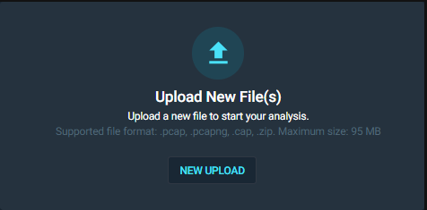

2. Select **Browse** or drag and drop your files into the Upload File panel.

    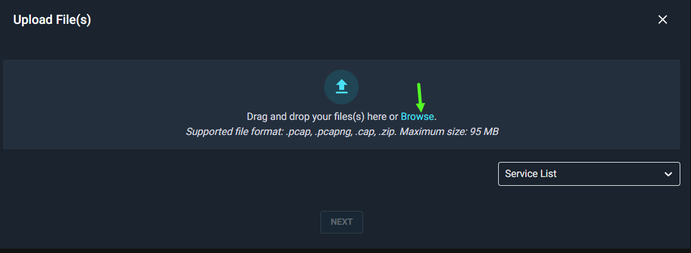

    Your file name will appear on the Upload File panel.

    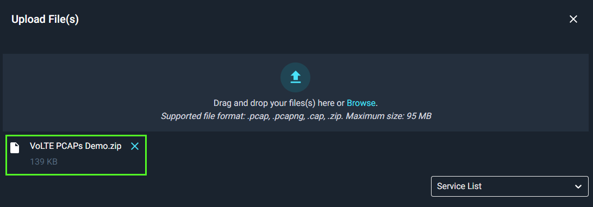

  </TabItem>
  <TabItem value="Select Existing File(s)" label="Select Existing File(s)">

To use previously uploaded network data capture files:

1. Choose **Select Existing File**.

    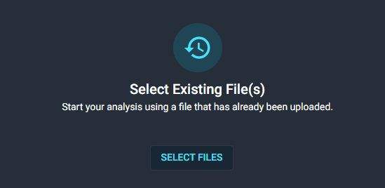

    a) Search for the file by name.

    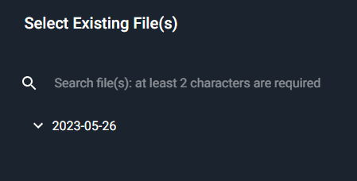

    OR

    b) Expand the folder and file drop-downs and choose the desired file.

2. Check the box beside the desired file to select it for analysis.

    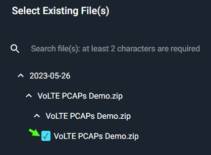

  </TabItem>
  <TabItem value="Preview an Analysis" label="Preview an Analysis">

To run an analysis using a pre-uploaded sample file:

1. Select **Choose Sample**.

    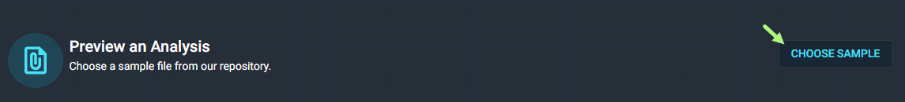

2. Select your file:

    a) Search for the file by name.

    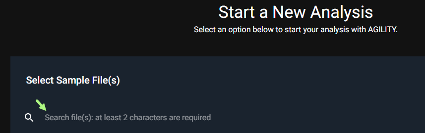

    b) Expand the folder and file drop-downs to choose the desired file.

    

3. Check the box beside the desired sample file to select it for analysis.

    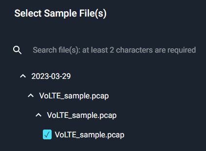

  </TabItem>
</Tabs>

You'll be directed to the selected file upload page.

## Select your service

You can select the service you wish to analyze. If you choose
auto-detection, all services AGILITY is able to detect will be analyzed.

1.  Expand the **Service List** drop-down list

2.  Select a service type from the list and select **Next**.

    The selected File(s) & Service(s) will be displayed.

### Service Auto-Detection

Service-Auto-Detection automatically detects the service type affiliated
with your file upload.

## Run Analysis

After your have selected your files and service, you are ready to
analyze.

1.  Select **Run Analysis**.

     Wait for the analysis to run. When the analysis is ready to view, the
Analyses list will display the file name with the label **completed**.

2.  Select the analysis.

    The High-Level Summary opens.

 Next: [Access your
analysis](https://d.docs.live.net/wiki/spaces/AKB1/pages/3037659168/Access+your+analyses).

# Analyze PCAP files

## What is an Analysis?

Running analyses on AGILITY provides users with insights for network assurance. Engineers and networking professionals use AGILITY to accelerate network analyses for troubleshooting and validation purposes. 

## Supported file formats for network capture uploads

The support file formats for upload on AGILITY include pcap, .pcapng, .cap, .zip.

### Supported browsers
For optimal performance, use AGILITY on the following browsers:

- Chrome version 109 and above

- Edge version 109 and above

- Firefox version 123 and above

- Safari version 17 and above

Using earlier versions may result in delays in call flow diagram filtering and noticeable performance lags.

## Start a new analysis

To start a new analysis, you can upload your PCAP file, select a previously uploaded file, or run a mock analysis using a sample network data capture file.

:::note  
> The maximum allowable PCAP upload size on the AGILITY UI is 95 MB PCAP per analysis session.

:::

1. Select **Start a New Analysis** from the side navigation panel.

    

    The Start a New Analysis page opens.

2. Choose your analysis path:

import Tabs from '@theme/Tabs';
import TabItem from '@theme/TabItem';

<Tabs>
  <TabItem value="Upload New File" label="Upload New File" default>

AGILITY supports: 

- pcap
- .pcapng 
- .cap 
- .zip

You can only upload one file at a time.

1. To upload a new network data capture file for analysis, click **New Upload**.

    

1. Select **Browse** or drag and drop your files into the Upload File panel. 

    

    Your file name will appear on the Upload File panel.

    

  </TabItem>
  <TabItem value="Select Existing File(s)" label="Select Existing File(s)">
    
    To use previously uploaded network data capture files: 

1. Choose **Select Existing File**.

    

    a) Search for the file by name. 

    

    OR

    b) Expand the folder and file drop-downs and choose the desired file.

2. Check the box beside the desired file to select it for analysis. 

    

  </TabItem>
  <TabItem value="Preview an Analysis" label="Preview an Analysis">

    To run an analysis using a pre-uploaded sample file: 

1. Select **Choose Sample**.

    

2. Select your file:

    a) Search for the file by name. 

    

    b) Expand the folder and file drop-downs to choose the desired file.

    

3. Check the box beside the desired sample file to select it for analysis. 

    

  </TabItem>
</Tabs>

### Select your service

You can select the service you wish to analyze. If you choose auto-detection, all services AGILITY is able to detect will be analyzed.

1.	Expand the Service List drop-down list

    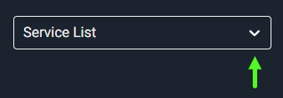
 
2.	Select a service type(s) from the list and select Next.

    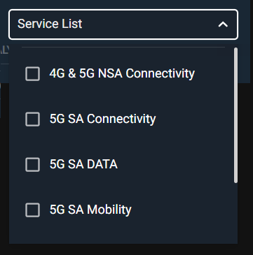
 
#### Service Auto-Detection

If you do not select a service, AGILITY Service-Auto-Detection automatically detects the service type affiliated with your file upload.

## Run Analysis

After your have selected your files and service, you are ready to analyze.

1. Select **Run Analysis**. 

    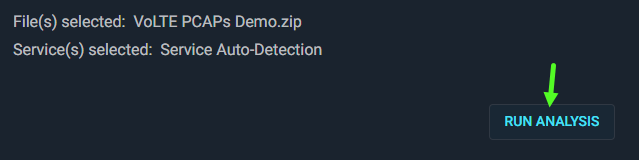

   Wait for the analysis to run. When the analysis is ready to view, the **Analyses** list will display the file name with the label *completed*.

2. Select the analysis. 

    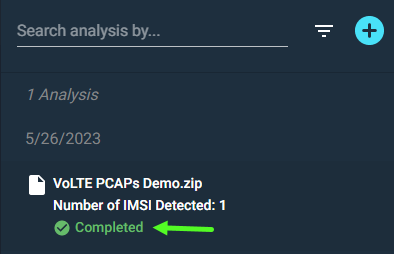

    The High-Level Summary opens. 

    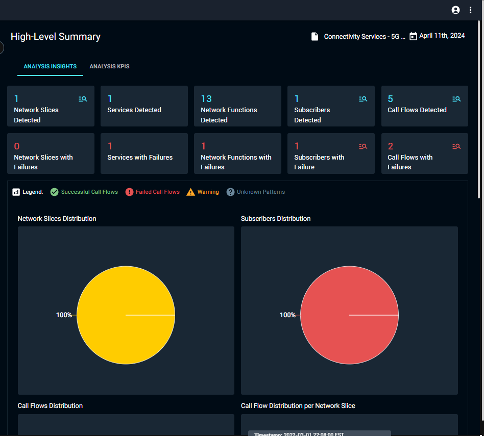
