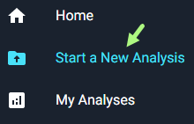

# Analyze PCAP files

## What is an Analysis?

Running analyses on AGILITY provides users with insights for network assurance. Engineers and networking professionals use AGILITY to accelerate network analyses for troubleshooting and validation purposes. 

## Supported file formats for network capture uploads

The support file formats for upload on AGILITY include pcap, .pcapng, .cap, .zip.

### Supported browsers
For optimal performance, use AGILITY on the following browsers:

- Chrome version 109 and above

- Edge version 109 and above

- Firefox version 123 and above

- Safari version 17 and above

Using earlier versions may result in delays in call flow diagram filtering and noticeable performance lags.

## Start a new analysis

To start a new analysis, you can upload your PCAP file, select a previously uploaded file, or run a mock analysis using a sample network data capture file.

[!NOTE]  
> The maximum allowable PCAP upload size on the AGILITY UI is 95 MB PCAP per analysis session.

1. Select **Start a New Analysis** from the side navigation panel.

The Start a New Analysis page opens.

2. Choose you analysis path:

import Tabs from '@theme/Tabs';
import TabItem from '@theme/TabItem';

<Tabs>
  <TabItem value="Upload New File" label="Upload New File" default>
Upload a network data capture file

AGILITY supports: 

- pcap
- .pcapng 
- .cap 
- .zip

You can only upload one file at a time.

1. To upload a new network data capture file for analysis, click New Upload.

Open upload-new-file.png
upload-new-file.png

2. Select Browse or drag and drop your files into the Upload File panel. 

Open image-20230526-185219.png
image-20230526-185219.png

Your file name will appear on the Upload File panel.

Open image-20230526-191323.png
image-20230526-191323.png

  </TabItem>
  <TabItem value="Select Existing File(s)" label="Select Existing File(s)">
    To use previously uploaded network data capture files: 

Click Select Existing File.

Open image-20230530-141005.png
image-20230530-141005.png

a) Search for the file by name. 

Open image-20230530-142857.png
image-20230530-142857.png

OR

b) Expand the folder and file drop-downs and choose the desired file.

2. Check the box beside the desired sample file to select it for analysis. 

Open image-20230530-144630.png
image-20230530-144630.png
  </TabItem>
  <TabItem value="Preview an Analysis" label="Preview an Analysis">
    To run an analysis using a pre-uploaded sample file: 

Click Choose Sample.

Open image-20230508-182603.png
image-20230508-182603.png
Select your file:

a) Search for the file by name. 

Open image-20230508-190237.png
image-20230508-190237.png
b) Expand the folder and file drop-downs to choose the desired file.

Open image-20230508-190519.png
image-20230508-190519.png
Check the box beside the desired sample file to select it for analysis. 

Open image-20230508-190645.png
image-20230508-190645.png
  </TabItem>
</Tabs>

