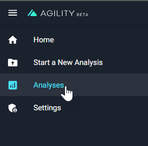
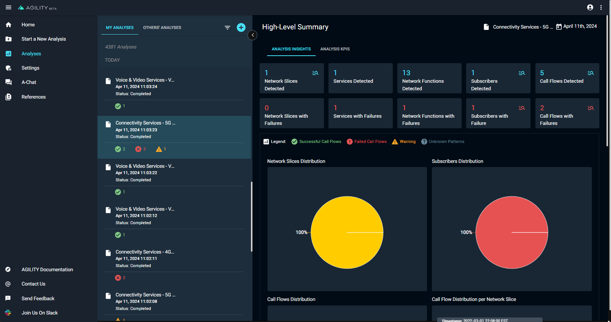
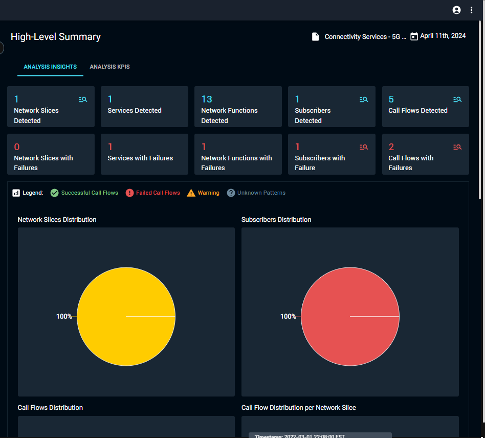
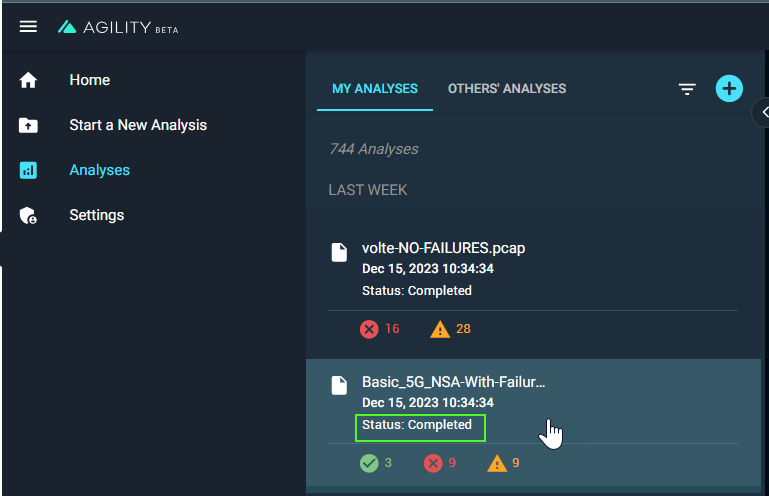

# View your analyses

## Access your analyses


To view your analyses, select **Analyses** from the navigation menu.





A list of analyses opens next to the Navigation menu.


## View Analyses

Under the **My Analyses** tab, you’ll find a list of the files you’ve uploaded, accompanied by their analysis status.

If there are others working in the same AGILITY environment, you’ll find a list of the files uploaded by others under the **Others' Analyses** tab.

To view the Analysis Details for any given analysis:

Click on a file with the **completed** label to view details.





The High-Level Summary Page opens next to the My Analyses tab.





## View file upload/processing statuses

You can view the status of your analysis files from the **My Analyses** tab.





There are four file upload/processing statuses:


<table>
  <tr>
   <td><strong>Processing</strong>
   </td>
   <td>The file(s) is still being processed.
   </td>
  </tr>
  <tr>
   <td><strong>Completed</strong>
   </td>
   <td>Your file has been successfully processed and the analysis details are ready for your review.
   </td>
  </tr>
  <tr>
   <td><strong>Processing error</strong>
   </td>
   <td>AGILITY could not process your files due to file errors. The precise reason for each failure is provided in the UI. After reviewing the reason for the failure, you can determine how to re-upload your files and re-run the analysis. Processing errors include timeouts.
   </td>
  </tr>
  <tr>
   <td><strong>Completed with errors</strong>
   </td>
   <td>Something went wrong during file processing. For example:
<ul>

<li>A prediction script error on our end

<li>Auto-detection detected the incorrect service

<li>The user selected the incorrect service

<li>We do not have a model that is compatible with the network captures that were uploaded
</li>
</ul>
   </td>
  </tr>
</table>


---


Next: [Filter and sort your analyses](https://nexiusocp.atlassian.net/wiki/spaces/AKB1/pages/3200450621) or View the [High Level Summary](https://nexiusocp.atlassian.net/wiki/spaces/AKB1/pages/2909536753).

Documents are **groups of pages** connected through:

- a **sidebar**
- **previous/next navigation**
- **versioning**

## Create your first Doc

Create a Markdown file at `docs/hello.md`:

```md title="docs/hello.md"
# Hello

This is my **first Docusaurus document**!
```

A new document is now available at [http://localhost:3000/docs/hello](http://localhost:3000/docs/hello).

## Configure the Sidebar

Docusaurus automatically **creates a sidebar** from the `docs` folder.

Add metadata to customize the sidebar label and position:

```md title="docs/hello.md" {1-4}
---
sidebar_label: 'Hi!'
sidebar_position: 3
---

# Hello

This is my **first Docusaurus document**!
```

It is also possible to create your sidebar explicitly in `sidebars.js`:

```js title="sidebars.js"
export default {
  tutorialSidebar: [
    'intro',
    // highlight-next-line
    'hello',
    {
      type: 'category',
      label: 'Tutorial',
      items: ['tutorial-basics/create-a-document'],
    },
  ],
};
```
